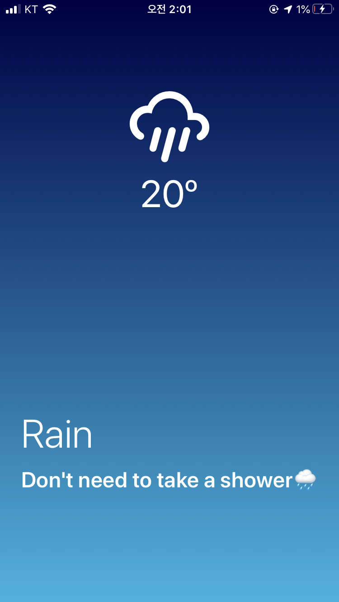
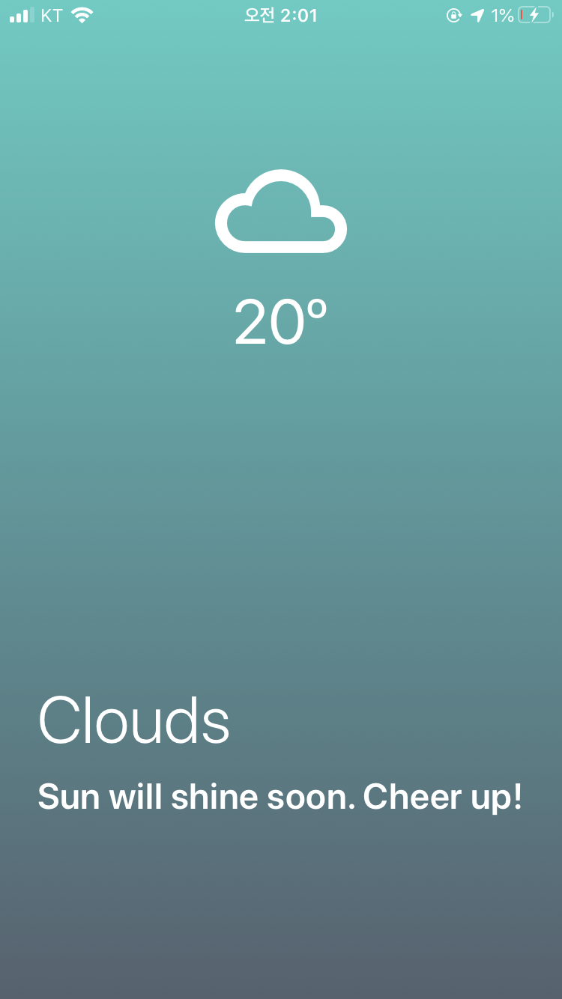
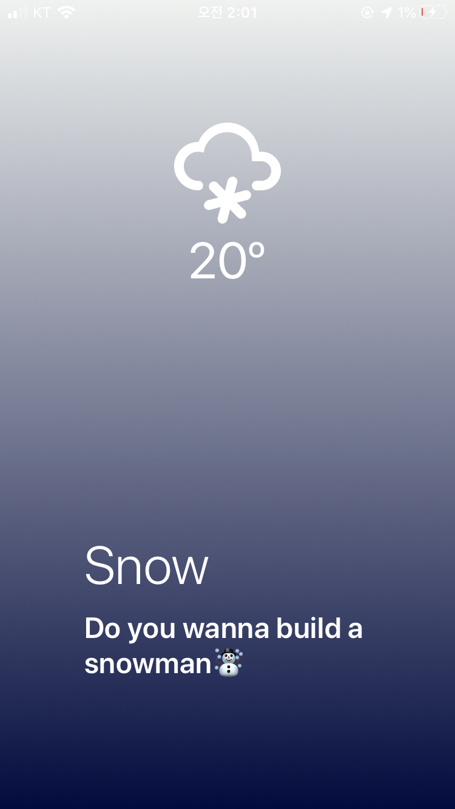
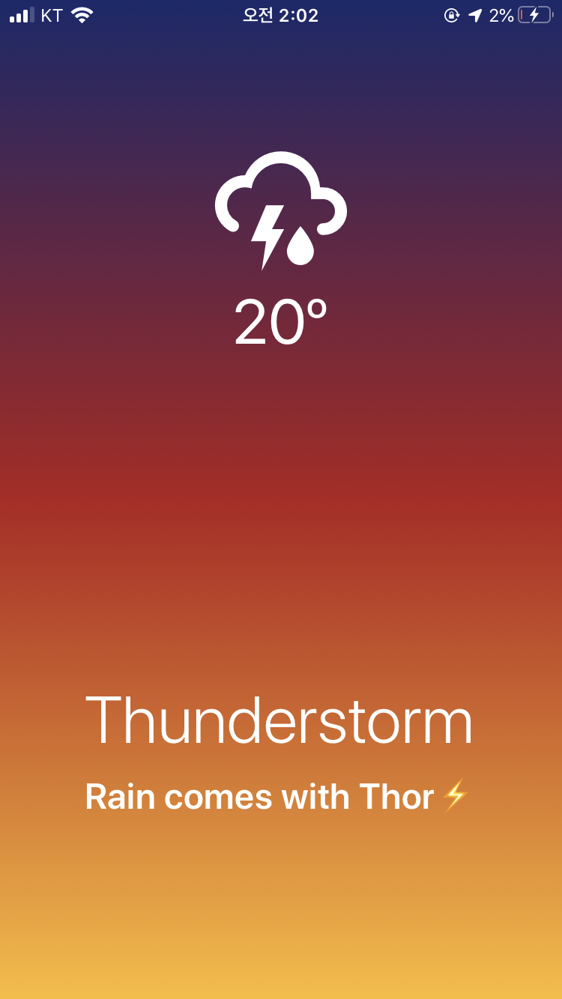
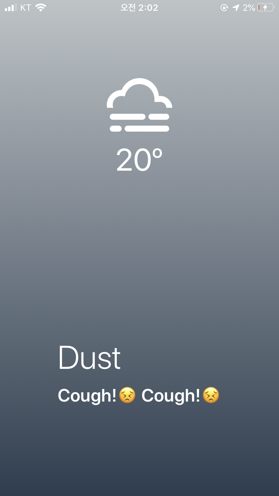

# Awesome-weather

#### [링크](https://expo.io/@seanny/Awesome-weather)

## 🌵 프로젝트 소개

🌧 Open Weather API와 Expo-location를 활용한 React Native 날씨앱, User location-based weather app using React Native.
Expo 앱으로 위 링크의 QR코드를 인식하면 바로 실행할 수 있습니다.

 

## 📸 구현 화면

|             맑음             |             비              |
| :--------------------------: | :-------------------------: |
|  |  |

|             구름              |             눈              |
| :---------------------------: | :-------------------------: |
|  |  |

|                태풍                 |          미세먼지           |
| :---------------------------------: | :-------------------------: |
|  |  |

 

## 🛠 기술 스택

|                 모바일 프레임워크                 |                     날씨 API                     |           빌드/배포 프레임워크            |
| :-----------------------------------------------: | :----------------------------------------------: | :---------------------------------------: |
|  |  |  |

 

## What I Learned

- Opne API와 Axios를 사용하여 데이터를 가져오는 방법
- Async/Await을 사용해서 비동기 처리
- Expo 프레임워크를 사용해서 React-Native 앱 빌드/배포 과정 처리
